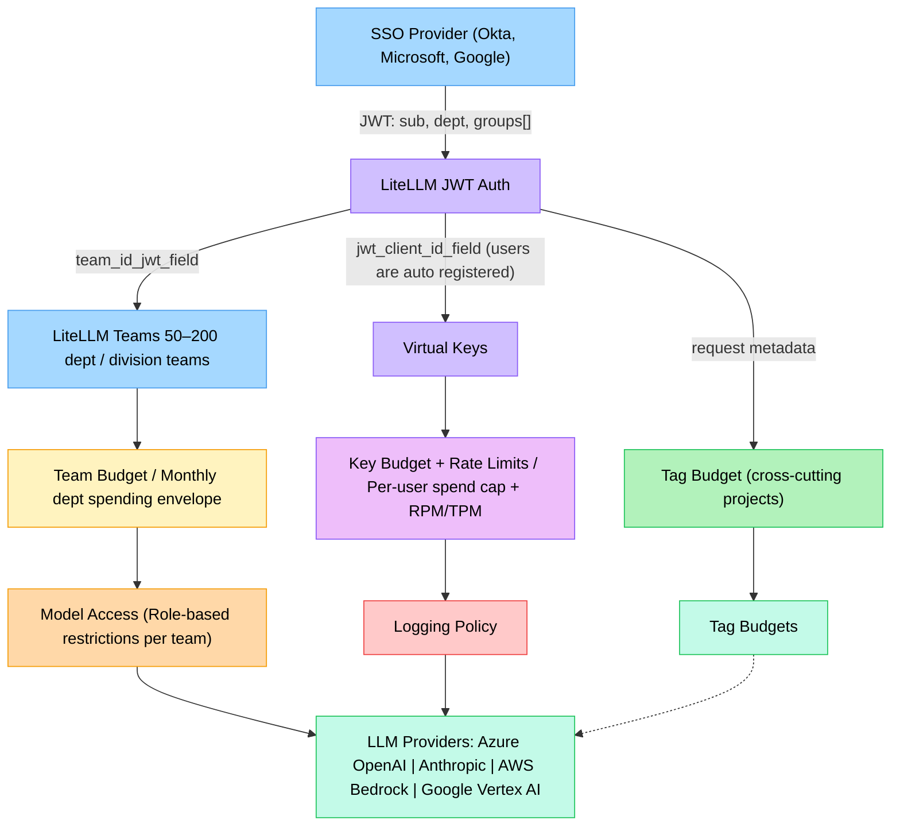

import Tabs from '@theme/Tabs';
import TabItem from '@theme/TabItem';

# ✨ Understanding Enterprise Architecture

## TL;DR

- **Audience:** Platform and IT teams deploying LiteLLM for 3,000–5,000 employees with an SSO provider (Entra, Okta, Google)
- **Teams map to cost centers, not AD groups.** At this scale you want 50–200 LiteLLM teams, not thousands. Use a stable JWT claim like `department` for team assignment.
- **Budget enforcement stacks across four layers:** organization → team → project → key. Any layer can block a request independently.
- **Logging exemptions live on the key.** Legal and executive users stay in their department team for spend rollup — no separate teams needed.
- **Non-human identities** (pipelines, internal apps, CI/CD) use virtual keys issued directly to teams or projects, not JWTs.

---

## Architecture Diagram



---

## Quickstart Checklist

For a standard SSO-backed deployment at enterprise scale:

- [ ] **Expose the right JWT claims.** At minimum: `sub` (user identity), `department` or `division` (team assignment). See [JWT Configuration](#jwt-configuration).
- [ ] **Enable JWT auth** in your proxy config with `auto_register` for zero-touch onboarding. See [JWT Auth Setup](./token_auth.md).
- [ ] **Create teams** matching your department/cost-center structure (50–200, not one per AD group).
- [ ] **Create organizations** for each division that needs budget delegation to a non-admin lead. See [Access Control (RBAC)](./access_control.md).
- [ ] **Pre-provision sensitive users** (legal, exec) with logging exemptions before their first request. Everyone else is handled by `auto_register`.
- [ ] **Provision service account keys** for pipelines and internal apps — these don't use JWTs. See [Operational Runbooks](#appendix-operational-runbooks).
- [ ] **Configure provider fallbacks** for any model tier that must be highly available. See [Provider Failover](#provider-failover-and-multi-provider-strategy).

---

## Design Q&A

The most common question we get from enterprises at this scale is: *how do we structure multiple orgs, teams, enforce budgets, and logging policies after we have onboarded users with an IdP?* The answer cuts across several features.

**Your IdP is the source of truth.** No group memberships or access policies are manually maintained in LiteLLM — everything flows from JWT claims. LiteLLM manages only what your IdP cannot express: spend limits and logging policy.

| Owned by IdP / SSO | Owned in LiteLLM |
|---|---|
| User identity (`sub` claim) | Team monthly budget |
| Team assignment (JWT `department` claim) | Per-user spend cap and rate limits |
| Offboarding (JWT revocation) | Elevated model access per key |
| Org hierarchy (division → department) | Logging exemption flags |

**Budgets stack.** Team, project, key, and tag budgets are independent layers — all enforced per request. A user can be blocked by their personal cap without the team budget being exhausted.

**Logging exemptions live on the key, not the team.** Legal counsel stays in the legal department team for spend rollup, but their key has `turn_off_message_logging: true`. No team duplication. See [Logging Policy for Sensitive Groups](#logging-policy-for-sensitive-groups).

---

## Entity Hierarchy

LiteLLM's org structure maps cleanly to an enterprise org chart:

```
Organization  →  Division / Business Unit
  └── Team    →  Department / Sub-team
        ├── Project  →  Application / Use case
        │     └── Virtual Key  →  App credential
        └── User  →  Individual employee
              └── Virtual Key  →  JWT-mapped access credential
```

| LiteLLM Entity | Maps To | Number of employees |
|---|---|---|
| Organization | Division / Business Unit | 5–20 |
| Team | Department | 50–200 |
| Project | Application or internal use case | varies |
| Internal User | Individual employee | ~3,000 |
| Virtual Key | Per-user or per-application | varies |

:::info
Organizations add a budget and admin layer above teams. Recommended for large divisions that need budget delegation — an engineering org admin can control all engineering team budgets without proxy admin access.
:::

:::info
Projects sit between teams and keys. Use them when a team owns multiple distinct applications that each need their own budget, model access, and API keys — for example, a `flight-search-assistant` and a `hotel-recommendations` service both under the product team. See [Project Management](./project_management.md).
:::

---

## Which Entity Do I Use?

| I need to... | Use | Notes |
|---|---|---|
| Set a monthly spend cap for an entire department | Team budget | All user spend in that team rolls up to the team envelope |
| Isolate budget and model access for a specific application within a team | [Project](./project_management.md) | Keys are issued to the project; spend is tracked independently |
| Set a monthly spend cap for an individual | Key budget | Key-level cap enforces per-user limits independently of the team budget |
| Track spend across an initiative that spans multiple teams | Tag budget | Tags cross team boundaries; applied via `metadata.tags` on each request |
| Delegate budget control to a division lead without granting proxy admin | Organization + `org_admin` | Org admins manage all teams within their org; no platform-wide access |
| Restrict which models a department can access | Team (`models` field) | Model access is enforced at team level for all members |
| Restrict which models a specific application can access | Project (`models` field) | Project-level model list is independent of the team default |
| Restrict which models a specific user can access | Key (`models` field) | Key-level model list overrides the team default for that user only |
| Exclude a user from prompt logging | Key (`turn_off_message_logging: true`) | Logging exemption lives on the key; team membership and budget rollup are unaffected |
| Group service accounts for budget rollup | Team (manually assigned) | For pipelines and apps that don't arrive via JWT |

---

## JWT Configuration

### Minimum required claims

Your IdP application registration should expose at least:

```json
{
  "sub": "john.doe@corp.com",
  "department": "engineering",
  "division": "technology"
}
```

The `department` claim (or whichever attribute maps to your cost center structure) drives team assignment. `sub` drives per-user key identity. The `groups[]` array is not used directly for team assignment — use a scalar claim instead.

### Proxy config

```yaml
general_settings:
  master_key: sk-1234
  enable_jwt_auth: True
  litellm_jwtauth:
    user_id_jwt_field: "sub"              # user identity
    team_id_jwt_field: "department"        # maps JWT → LiteLLM team
    jwt_client_id_field: "sub"             # maps JWT → virtual key (for per-user tracking)
    unregistered_jwt_client_behavior: "auto_register"  # zero-touch onboarding

  user_roles_jwt_field: "roles"
  user_allowed_roles: ["LiteLLM.User"]

  role_permissions:
    - role: internal_user
      models: ["gpt-4o-mini", "claude-haiku-4-5"]  # default access tier
```

### How `auto_register` works

On a user's first request:
1. LiteLLM validates the JWT signature against your IdP's public keys.
2. It extracts `sub` (user identity) and `department` (team assignment).
3. If no virtual key mapping exists for this `sub`, it creates one and links it to the department team.
4. All subsequent requests hit the cached mapping — no DB lookup after the first call.

When someone moves departments, their next JWT carries the new `department` claim and they are re-slotted automatically.

---

## Budget Enforcement

Four independent budget layers are checked on every request. Any one can block the call.

### Layer 1: Team budget (department envelope)

Set once per department. This is your cost center rollup — the aggregate monthly spend for an entire team.

```bash
curl -X POST 'http://your-litellm-proxy:4000/team/new' \
  -H 'Authorization: Bearer <MASTER_KEY>' \
  -H 'Content-Type: application/json' \
  -d '{
    "team_alias": "engineering",
    "organization_id": "<technology-division-org-id>",
    "models": ["gpt-4o-mini", "claude-haiku-4-5", "gpt-4o"],
    "max_budget": 5000.0,
    "budget_duration": "30d"
  }'
```

### Layer 2: Project budget (application envelope)

Set per application or use case within a team. See [Project Management](./project_management.md) for full setup.

### Layer 3: Key budget (per-user cap)

Auto-registered keys inherit the team limit by default — no per-user cap unless you set one. Only provision explicit key budgets for users who need a cap below the team envelope. For setup, see [Elevated Access Provisioning](#elevated-access-provisioning) in the runbooks.

### Layer 4: Tag budget (cross-team initiative)

Tag budgets track spend across team and user boundaries. Use them for initiative-level tracking where the budget owner is a cost code, not a department.

```bash
curl -X POST 'http://your-litellm-proxy:4000/tag/new' \
  -H 'Authorization: Bearer <MASTER_KEY>' \
  -H 'Content-Type: application/json' \
  -d '{
    "name": "project-alpha",
    "description": "AI features for Project Alpha",
    "max_budget": 2000.0,
    "budget_duration": "30d"
  }'
```

Users attach tags to requests in the `metadata` field:

```python
client.chat.completions.create(
    model="gpt-4o-mini",
    messages=[{"role": "user", "content": "..."}],
    extra_body={"metadata": {"tags": ["project-alpha"]}}
)
```

### Budget stack summary

| Layer | Granularity | Owner | Resets |
|---|---|---|---|
| Team budget | Department | IT / Finance | Monthly |
| Project budget | Application / use case | Team admin | Monthly |
| Key budget | Individual user or service account | IT / Manager | Monthly |
| Tag budget | Cross-team initiative | Project lead | Per initiative |

All layers are evaluated per request. The most restrictive limit wins.

---

## Logging Policy for Sensitive Groups

Legal and executive users need prompt logging disabled. The solution is key-level overrides — no separate teams needed.

### Recommended approach: global logging on, exempt individual keys

Enable logging globally. When provisioning keys for sensitive users, set `turn_off_message_logging: true` on the virtual key. The user's team membership and budget rollup are unchanged.

```bash
curl -X POST 'http://your-litellm-proxy:4000/jwt_client/new' \
  -H 'Authorization: Bearer <MASTER_KEY>' \
  -H 'Content-Type: application/json' \
  -d '{
    "jwt_claim_name": "sub",
    "jwt_claim_value": "counsel@corp.com",
    "team_id": "<legal-dept-team-id>",
    "models": ["gpt-4o", "claude-sonnet-4-5"],
    "max_budget": 300.0,
    "budget_duration": "30d",
    "metadata": {
      "logging": [{
        "callback_name": "langfuse",
        "callback_vars": {
          "turn_off_message_logging": true
        }
      }]
    }
  }'
```

This user appears in the legal department's spend rollup and is subject to team and key budgets, but their prompts and responses are never logged.

### Alternative: global log-off, opt-in per team

For organizations where the majority of users are in sensitive roles, invert the default:

```yaml
litellm_settings:
  turn_off_message_logging: true
```

Then enable logging only for teams that explicitly want it:

```bash
curl -X POST 'http://your-litellm-proxy:4000/team/<team_id>/callback' \
  -H 'Authorization: Bearer <MASTER_KEY>' \
  -H 'Content-Type: application/json' \
  -d '{
    "callback_name": "langfuse",
    "callback_type": "success_and_failure",
    "callback_vars": {
      "langfuse_public_key": "...",
      "langfuse_secret_key": "..."
    }
  }'
```

---

## Role-Based Access Control

LiteLLM's RBAC maps to your AD-driven admin delegation:

| AD Role | LiteLLM Role | Scope |
|---|---|---|
| IT / Platform team | `proxy_admin` | Full platform — all orgs, teams, budgets |
| Finance / Audit | `proxy_admin_viewer` | Platform-wide spend visibility, read-only |
| Division lead | `org_admin` | Their division (organization) only |
| Team lead | `team_admin` | Their team only — manage members, budgets, keys |
| Employee | `internal_user` | Their own keys and spend |

Division leads (org admins) can create new teams within their org and set team budgets without needing proxy admin access. Team leads can add/remove members and create keys for their team without org admin access.

Assign elevated roles manually for the small set of admins — these don't change frequently enough to warrant automation:

```bash
curl -X POST 'http://your-litellm-proxy:4000/organization/member_add' \
  -H 'Authorization: Bearer <MASTER_KEY>' \
  -H 'Content-Type: application/json' \
  -d '{
    "organization_id": "<technology-division-org-id>",
    "member": {"role": "org_admin", "user_id": "division.lead@corp.com"}
  }'
```

See [Access Control (RBAC)](./access_control.md) for the full role reference.

---

## Model Access Tiers

Define your available models in `model_list` and use `role_permissions` to set the default tier for all internal users. See [config reference](../docs/proxy/configs.md) for the full `model_list` schema.

```yaml
general_settings:
  role_permissions:
    - role: internal_user
      models: ["gpt-4o-mini", "claude-haiku-4-5"]
```

Grant elevated model access at the team level for departments that need it:

```bash
curl -X POST 'http://your-litellm-proxy:4000/team/update' \
  -H 'Authorization: Bearer <MASTER_KEY>' \
  -H 'Content-Type: application/json' \
  -d '{
    "team_id": "<engineering-team-id>",
    "models": ["gpt-4o-mini", "claude-haiku-4-5", "gpt-4o", "claude-sonnet-4-5"]
  }'
```

Individual elevated access (e.g., a principal engineer needing a frontier model) is handled at the key level — see [Elevated Access Provisioning](#elevated-access-provisioning) in the runbooks.

---

## Provider Failover and Multi-Provider Strategy

### Primary and fallback routing

Define multiple entries for the same `model_name` in your `model_list`. LiteLLM's router will try them in order and fail over if a provider is unhealthy:

```yaml
model_list:
  - model_name: gpt-4o
    litellm_params:
      model: azure/gpt-4o
      api_base: https://your-azure-endpoint.openai.azure.com
      api_key: os.environ/AZURE_API_KEY

  - model_name: gpt-4o          # same model_name — used as fallback
    litellm_params:
      model: openai/gpt-4o
      api_key: os.environ/OPENAI_API_KEY

router_settings:
  routing_strategy: least-busy
  num_retries: 2
  retry_after: 5
```

When Azure OpenAI is degraded, LiteLLM automatically routes `gpt-4o` requests to the OpenAI fallback. No client-side changes needed.

### Per-team data residency restrictions

Define separate model names for compliant providers and restrict teams to those names. Teams can only call the model names they're allowed — they cannot access providers behind other names.

```yaml
model_list:
  - model_name: gpt-4o-eu          # Azure EU region only
    litellm_params:
      model: azure/gpt-4o
      api_base: https://your-eu-endpoint.openai.azure.com
      api_key: os.environ/AZURE_EU_API_KEY

  - model_name: gpt-4o             # global routing with fallback
    litellm_params:
      model: azure/gpt-4o
      api_base: https://your-us-endpoint.openai.azure.com
      api_key: os.environ/AZURE_US_API_KEY
```

Then restrict the legal team to EU-only models:

```bash
curl -X POST 'http://your-litellm-proxy:4000/team/update' \
  -H 'Authorization: Bearer <MASTER_KEY>' \
  -H 'Content-Type: application/json' \
  -d '{
    "team_id": "<legal-team-id>",
    "models": ["gpt-4o-eu"]
  }'
```

### During a provider outage

LiteLLM's health check (`/health`) marks a provider as unhealthy after repeated failures and stops routing to it until it recovers. No manual intervention is needed if you have a fallback configured. For any model tier that must be highly available, always configure at least one fallback entry.

---

## Observability and Alerts

### What to monitor

| Signal | Why it matters |
|---|---|
| Team spend vs. budget (%) | Early warning before a department hits its cap and gets blocked |
| Per-key spend spikes | Detect runaway usage or compromised keys |
| RPM / TPM per team and key | Rate limit headroom; spikes indicate load changes or abuse |
| Provider error rate and latency | Detect degradation before it impacts users; trigger fallover review |
| `auto_register` rate | Sudden spikes may indicate misconfigured clients or token replay |

### Recommended alert thresholds

- **Team budget ≥ 80%** — notify the team admin and IT. At 100% the team is blocked.
- **Key budget ≥ 80%** — notify the user or their manager.
- **Provider error rate > 5% over 5 minutes** — page on-call; verify fallback is routing.
- **RPM sustained at > 90% of limit** — proactive capacity review before hard limit is hit.

### Dashboard guidance

Expose LiteLLM's `/metrics` endpoint to your observability stack (Prometheus, Datadog, Grafana). At minimum, track per-team and per-key spend, request volume, and provider error rates as separate panels. See [Team Logging](./team_logging.md) for logging callback configuration.

---

## Appendix: Operational Runbooks

### New employee onboarding

No action required. On first request, `auto_register` creates their virtual key and assigns them to the team derived from their `department` JWT claim.

### Employee department transfer

No action required. Their next JWT carries the new `department` claim. LiteLLM re-assigns team membership on the next request.

### Employee offboarding

Revoke access at the IdP level (standard offboarding). Their JWT is invalidated — no LiteLLM-side action needed. Spend history is retained for audit purposes.

### Elevated access provisioning

For users needing model access or budget beyond the team default:

```bash
curl -X POST 'http://your-litellm-proxy:4000/jwt_client/update' \
  -H 'Authorization: Bearer <MASTER_KEY>' \
  -H 'Content-Type: application/json' \
  -d '{
    "jwt_claim_name": "sub",
    "jwt_claim_value": "senior.eng@corp.com",
    "models": ["gpt-4o", "claude-sonnet-4-5", "claude-opus-4-7"],
    "max_budget": 500.0
  }'
```

This is the only ongoing manual action in normal operations — everything else flows from the IdP.

### Service account provisioning

CI/CD pipelines, scheduled jobs, and internal apps don't authenticate via JWT — they need virtual keys provisioned directly. Assign them to the team that owns the workload so spend rolls up to the right cost center.

```bash
curl -X POST 'http://your-litellm-proxy:4000/key/generate' \
  -H 'Authorization: Bearer <MASTER_KEY>' \
  -H 'Content-Type: application/json' \
  -d '{
    "team_id": "<data-engineering-team-id>",
    "key_alias": "pipeline-nightly-embeddings",
    "max_budget": 500.0,
    "budget_duration": "30d",
    "rpm_limit": 100,
    "metadata": {"service_account": true, "owner": "data-platform-team"}
  }'
```

Store the returned key in your secrets manager. Reference it as a standard `Authorization: Bearer sk-...` header — no JWT required.

### Key rotation

LiteLLM supports built-in key rotation with a configurable grace period. The old key remains valid during the grace window while you update references in your secrets manager. See [Virtual Keys](./virtual_keys.md) for rotation API details.

### Emergency stop

To immediately block all requests from a team (e.g., runaway spend, security incident):

```bash
curl -X POST 'http://your-litellm-proxy:4000/team/update' \
  -H 'Authorization: Bearer <MASTER_KEY>' \
  -H 'Content-Type: application/json' \
  -d '{
    "team_id": "<team-id>",
    "blocked": true
  }'
```

To block a single key:

```bash
curl -X POST 'http://your-litellm-proxy:4000/key/block' \
  -H 'Authorization: Bearer <MASTER_KEY>' \
  -H 'Content-Type: application/json' \
  -d '{"key": "sk-..."}'
```

Both are reversible — set `"blocked": false` or call `/key/unblock` to restore access.

---

## Related Docs

- [JWT Auth Setup](./token_auth.md) — configuring `JWT_PUBLIC_KEY_URL` and enabling JWT auth
- [JWT → Virtual Key Mapping](./jwt_key_mapping.md) — per-client key mapping and `auto_register`
- [Access Control (RBAC)](./access_control.md) — full role reference and org/team hierarchy
- [Team Logging](./team_logging.md) — per-team and per-key logging configuration
- [Project Management](./project_management.md) — application-level budgets, model access, and keys within a team
- [Tag Budgets](./tag_budgets.md) — cross-team initiative spend tracking
- [Virtual Keys](./virtual_keys.md) — key lifecycle management
